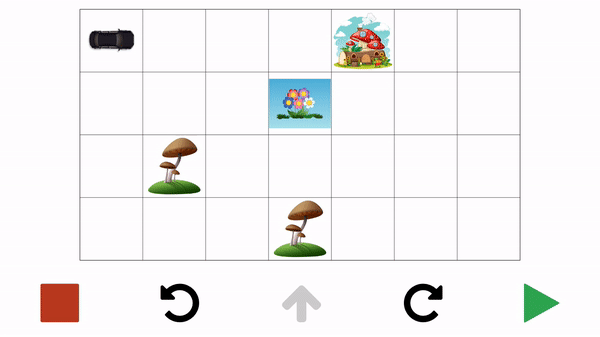

# animated-car
Frontend of the game made for children with React Native
## Getting Started

These instructions will get you a copy of the project up and running on your local machine for development and testing purposes. See deployment for notes on how to deploy the project on a live system.

### Prerequisites

- expo

### Installing

```
git clone https://github.com/erhanersoz/animated-car.git
```

If using yarn
```
yarn install
```

If using npm
```
npm install
```

### Usage

```
expo start
```
### Demo


